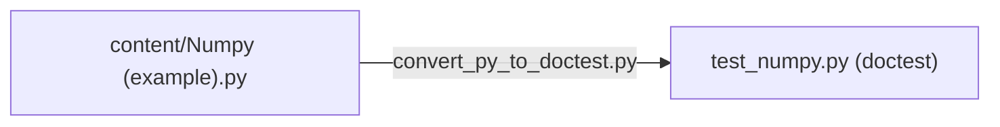

# Contributing guidelines

- tldr
    - edit files inside the [content](https://github.com/gmatt/mnist-in-y-minutes/tree/main/content) directory
    - tip: use "Add file" and "Edit this file" buttons on GitHub, they automatically create pull requests

## How can I contribute?

Any contributions are welcome. There are multiple options.

### Report an issue

You can report an issue by clicking on [💬 Report an issue](https://github.com/gmatt/mnist-in-y-minutes/issues/new)
on the home page, or a specific library page. You need to have a GitHub account for this.

### Suggest changes

You can also suggest changes to existing example codes by clicking "Suggest changes" on a library page. Then click
"Fork this Repository" if prompted. Edit the file and click "Propose changes". Click "Create pull request". Describe
briefly what you have changed, and finally click "Create pull request" to submit for review.

### Add a new library

Finally, you can add a new library by clicking
the [➕ Add a new library](https://github.com/gmatt/mnist-in-y-minutes/new/main?filename=/content/.py) button on the home
page, and following the same pull request process as in the previous point. The filename will become the title of the
page.

## Automated (doctest) testing

This part is optional.

To check if the example codes work in general, and produce the expected
output, [doctest](https://docs.python.org/3/library/doctest.html) is used.

[GitHub Actions](https://github.com/gmatt/mnist-in-y-minutes/actions) runs these tests automatically as part of a CI/CD,
but you can also [try it locally](#how-to-convert-to-doctest) manually before committing. (If you create a pull request,
GitHub Actions will run the doctest, but it requires our approval first.)

Passing this test is not required to make a contribution.

### GitHub Actions

[GitHub Actions](https://github.com/gmatt/mnist-in-y-minutes/actions) is used for CI/CD and testing (see workflows in
the sidebar that starts with `doctest-` for doctests).

Automated testing is run on the following events:

- a Python file in the `content` directory changes
- on pull requests (after our approval)

Every Python file in the `content` directory is converted into a doctest by a
custom [convert_py_to_doctest.py](../utils/convert_py_to_doctest.py) script, the test is run with GitHub Actions (with
pytest, after also running the commands marked with the [shell command marker](#shell-command-marker---)), and the
results are reported on the GitHub Action run output.

The latest testing results are also visible on the library pages as build status badges.

### Example workflow



*A visualization for the following example.*

### Example file

`content/Numpy (example).py`

```python
# ! pip install numpy

import numpy as np

# np.arange() is a more advanced version of Python's built-in range().
# As with range(), the end of the interval is not included.
np.arange(0, 1, 0.1)
# <<< array([0. , 0.1, 0.2, 0.3, 0.4, 0.5, 0.6, 0.7, 0.8, 0.9])

```

### How to convert to doctest

If you clone the repository, then you can use the [convert_py_to_doctest.py](../utils/convert_py_to_doctest.py) script
like this (requires Python 3.8):

```bash
python utils/convert_py_to_doctest.py "content/Numpy (example).py" test_numpy.py
# Written output to 'test_numpy.py'.
```

The script may fail for certain Python syntaxes. If so, then there is nothing you can do about it until someone fixes
the script.

### The doctest file

`test_numpy.py`

```python
"""
>>> # ! pip install numpy

>>> import numpy as np

>>> # np.arange() is a more advanced version of Python's built-in range().
>>> # As with range(), the end of the interval is not included.
>>> np.arange(0, 1, 0.1)  # doctest: +ELLIPSIS, +NORMALIZE_WHITESPACE
array([0. , 0.1, 0.2, 0.3, 0.4, 0.5, 0.6, 0.7, 0.8, 0.9])
"""

if __name__ == "__main__":
    import doctest

    doctest.testmod()

```

Note the line `array([0. , 0.1,...` which acts as an assertion.

To run this, first, make sure that you're in a Python environment where all the `pip install`s marked in the file are
present.

You can run this doctest in your IDE at your convenience.
E.g. [PyCharm](https://www.jetbrains.com/help/pycharm/performing-tests.html)
, [VSCode](https://code.visualstudio.com/docs/python/testing), etc.

Alternatively, you can run this file directly.

```bash
python test_numpy.py
# This should pass.
```

The doctest file uses the flags `+ELLIPSIS` and `+NORMALIZE_WHITESPACE` which are frequently used in doctests as they
make writing assertions easier. NORMALIZE_WHITESPACE means `"a    b"` = `"a b"` and works with newlines too, and
ELLIPSIS means you can use ellipses to skip content, e.g. `abc`
= `a...c` ([docs](https://docs.python.org/3.11/library/doctest.html#doctest.NORMALIZE_WHITESPACE)).

### Special comment markers

There are two markers that have a special meaning on this site when used in code comments.

The space between the marker and the command is mandatory.

#### Shell command marker: `# ! `

```python
# ! pip install <library name>
```

These commands will be executed in the shell before doctest testing on CI.

Typically, the first line of the Python file is a pip install (although this is not mandatory).

Without this, we wouldn't know exactly which Python library to install when testing the code.

Multiple pip installs, including version specifications, and other commands preparing the environment are also fine. The
CICD runs them in an Ubuntu Bash shell by default.

#### Output marker: `# <<< `

```python
1 + 2
# <<< 3
```

The output of every command that produces an output is marked in the Python example codes for clarity. (This is the
output that you'd get if you ran the file line by line in an interactive shell, or in a Jupyter notebook cell by
cell. `print()`s count too.)

Including the output like this is not required, but highly recommended.

The marker is similar to what doctest and Python interactive shell uses. (Just flipped, so `>>>` is input, and `<<<` is
output.)

For multiline output, every line should start with the marker.
